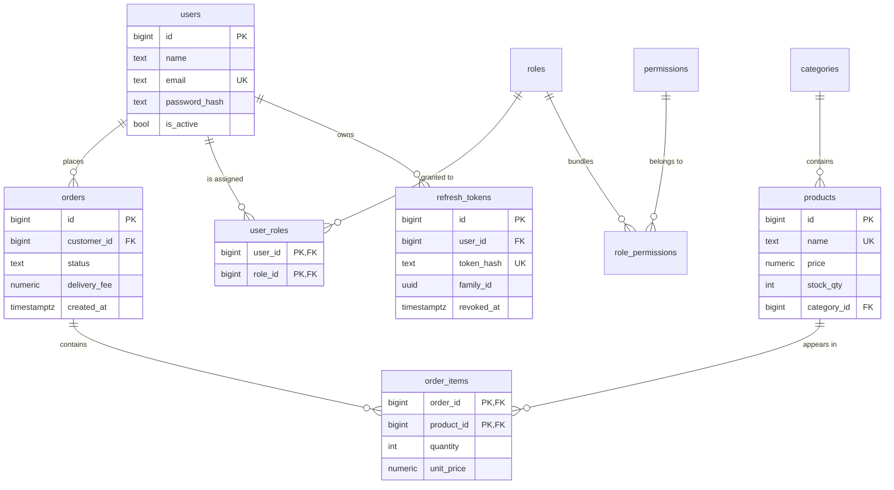

# SE3090 — Lecture 04 Demo Project
## LankaMart: Database Design, Authentication, Authorization and Integration

This is the working code behind Lecture 04. It is the **same LankaMart API you met in
Lecture 03**, with the two things that lecture deliberately left out:

* a **real PostgreSQL database** behind the repositories, instead of a dictionary in memory
* a **real security model** — passwords, tokens, roles and permissions — instead of an API
  where every caller is anonymous and equally trusted

Everything on slides 8 to 42 exists somewhere in this repository, and most of it can be made
to **fail on purpose** in front of a class. That is the point: a 403 you watched happen is
worth more than a definition you read.

> **Read this file top to bottom the first time.** Sections 1 to 4 get it running on your
> laptop. Everything after that is the tour.

---

## Contents

| # | Section |
|---|---------|
| 1 | [What you need before you start](#1-what-you-need-before-you-start) |
| 2 | [Setup, step by step](#2-setup-step-by-step) |
| 3 | [Check that it works](#3-check-that-it-works) |
| 4 | [Demo accounts](#4-demo-accounts) |
| 5 | [The ten-minute tour](#5-the-ten-minute-tour) |
| 6 | [The database](#6-the-database) |
| 7 | [The API](#7-the-api) |
| 8 | [Where each slide lives in the code](#8-where-each-slide-lives-in-the-code) |
| 9 | [Experiments — try to break it](#9-experiments--try-to-break-it) |
| 10 | [What changed since Lecture 03](#10-what-changed-since-lecture-03) |
| 11 | [Troubleshooting](#11-troubleshooting) |
| 12 | [What is deliberately NOT here](#12-what-is-deliberately-not-here) |

---

## 1. What you need before you start

| Tool | Version | Where |
|------|---------|-------|
| .NET SDK | **8.0** (LTS) | <https://dotnet.microsoft.com/download/dotnet/8.0> |
| PostgreSQL | **16** | <https://www.postgresql.org/download/> (the EDB installer includes pgAdmin 4) |
| An editor | any | VS Code + **C# Dev Kit**, Visual Studio 2022 (17.8+), or Rider |
| EF Core CLI | 8.0 | installed in step 3 below |

Optional but useful: **Postman** (a ready-made collection is in `postman/`), or **Docker
Desktop** if you would rather not install PostgreSQL directly — see step 2, Option B.

Check what you have:

```bash
dotnet --version      # must start with 8.
psql --version        # 16.x   (or use Docker instead)
```

> **Windows note.** If `psql` is not found, add PostgreSQL's `bin` folder to your PATH —
> typically `C:\Program Files\PostgreSQL\16\bin`. You can also do everything in pgAdmin 4
> instead of `psql`; the SQL is identical.

---

## 2. Setup, step by step

### Step 1 — Get the code

Unzip the project (or clone it) and open a terminal at the folder that contains
`LankaMart.sln`.

```bash
cd SE3090_Lecture04_Demo
dotnet restore
```

The first restore downloads five packages and takes a minute. If it fails, jump to
[Troubleshooting](#11-troubleshooting) — the usual cause is a version 9 package sneaking into
a .NET 8 project.

---

### Step 2 — Create the database

Pick **one** of these two options.

#### Option A — PostgreSQL installed on your laptop

Open `psql` **as the postgres superuser**:

```bash
# Windows (Command Prompt or PowerShell)
psql -U postgres

# macOS / Linux
sudo -u postgres psql
```

Then run this, changing the password to something of your own:

```sql
-- The database for this project
CREATE DATABASE lankamart;

-- SLIDE 23: a LEAST-PRIVILEGE application user.
-- The API must NOT connect as 'postgres'. If it does, one SQL injection flaw
-- stops being "an attacker read the products table" and becomes "an attacker
-- dropped the database".
CREATE USER lankamart_app WITH PASSWORD 'ChangeMe_Str0ng!';

GRANT CONNECT ON DATABASE lankamart TO lankamart_app;

\connect lankamart

-- Let the app create its own tables via EF Core migrations, and use them.
GRANT USAGE, CREATE ON SCHEMA public TO lankamart_app;
GRANT SELECT, INSERT, UPDATE, DELETE ON ALL TABLES IN SCHEMA public TO lankamart_app;
GRANT USAGE, SELECT ON ALL SEQUENCES IN SCHEMA public TO lankamart_app;

-- ...including tables that do not exist yet.
ALTER DEFAULT PRIVILEGES IN SCHEMA public
    GRANT SELECT, INSERT, UPDATE, DELETE ON TABLES TO lankamart_app;
ALTER DEFAULT PRIVILEGES IN SCHEMA public
    GRANT USAGE, SELECT ON SEQUENCES TO lankamart_app;

\q
```

> **Why `CREATE ON SCHEMA public`?** Because this user runs the migrations, so it must be
> able to create tables. In a real deployment you would migrate as a *separate*, more
> privileged account and let the running application connect with an account that can only
> read and write rows. Worth saying out loud: least privilege is a spectrum, not a switch.

#### Option B — PostgreSQL in Docker (nothing to install)

```bash
cd db
docker compose up -d
cd ..
```

That starts PostgreSQL 16 with the database and user already created, plus Adminer (a small
web UI) on <http://localhost:8080>. The matching password is `dev_only_password`.

---

### Step 3 — Install the EF Core command-line tool

```bash
dotnet tool install --global dotnet-ef --version 8.*

# already installed from another module? make sure it is version 8:
dotnet tool update --global dotnet-ef --version 8.*

dotnet ef --version
```

Close and reopen your terminal if `dotnet ef` is still "not recognised" — the global tools
folder is added to PATH only for new shells.

---

### Step 4 — Give the app its connection string ⚠️ **the step people skip**

Look in `src/LankaMart.Api/appsettings.json`. The connection string is **empty**, and there
is no signing key at all. That is not an oversight — it is slide 23. `appsettings.json` is
committed to Git, so it holds no secrets, ever.

Supply the value from outside the repository instead.

> ⚠️ **Type the `set` command on ONE line.** Do not break it with a `\` — that is a *bash*
> line continuation and PowerShell does not understand it. PowerShell will store a single
> backslash as your connection string and you will get
> *"Format of the initialization string does not conform to specification starting at
> index 0"* when you run `dotnet ef`.

**Windows (PowerShell):**

```powershell
cd src\LankaMart.Api
dotnet user-secrets set "ConnectionStrings:LankaMartDb" "Host=localhost;Port=5432;Database=lankamart;Username=lankamart_app;Password=ChangeMe_Str0ng!"
```

**macOS / Linux:**

```bash
cd src/LankaMart.Api
dotnet user-secrets set "ConnectionStrings:LankaMartDb" "Host=localhost;Port=5432;Database=lankamart;Username=lankamart_app;Password=ChangeMe_Str0ng!"
```

If you used **Docker (Option B)**, the password is `dev_only_password`.

User secrets are stored in your user profile, far away from the project folder, so they
cannot be committed by accident. **Always check what actually got stored:**

```bash
dotnet user-secrets list
```

It must print the whole string, starting with `Host=`:

```
ConnectionStrings:LankaMartDb = Host=localhost;Port=5432;Database=lankamart;Username=lankamart_app;Password=ChangeMe_Str0ng!
```

Anything else — a lone `\`, a truncated string, curly “smart quotes” pasted from a Word
document — means the shell mangled it. Run `dotnet user-secrets clear` and try again.

<details>
<summary>Alternative: an environment variable instead</summary>

```bash
# macOS / Linux
export ConnectionStrings__LankaMartDb="Host=localhost;Port=5432;Database=lankamart;Username=lankamart_app;Password=ChangeMe_Str0ng!"

# Windows PowerShell
$env:ConnectionStrings__LankaMartDb="Host=localhost;Port=5432;Database=lankamart;Username=lankamart_app;Password=ChangeMe_Str0ng!"
```

The double underscore `__` is how ASP.NET Core spells the `:` separator in environment
variable names. See `.env.example` for the full list of variables this project reads.

**Careful:** environment variables are read *after* user secrets, so they **override** them.
If you set one earlier with a typo, fixing the user secret will change nothing. Check with
`$env:ConnectionStrings__LankaMartDb` (PowerShell) or `echo $ConnectionStrings__LankaMartDb`
(bash), and clear it with `Remove-Item Env:ConnectionStrings__LankaMartDb` if it is wrong.
</details>

**What about the JWT signing key?** In Development it comes from
`appsettings.Development.json`, where it is clearly marked `DEVELOPMENT-ONLY`. That file is
committed so a fresh clone runs — and `Program.cs` **refuses to start** outside Development
if it sees that marker, because anyone reading this repository could otherwise mint
themselves an Admin token.

---

### Step 5 — Create the tables

```bash
cd src/LankaMart.Api

dotnet ef migrations add InitialCreate
dotnet ef database update
```

The first command generates `Migrations/` from `Data/AppDbContext.cs`. **Open the generated
file and read it** — that C# is the DDL from slide 20, produced from your model classes.
Compare it with the hand-written `db/schema_reference.sql`; they describe the same database.

The second command runs it against PostgreSQL. It creates the database too, if it does not
exist yet.

> Migrations are not shipped with this project on purpose: generating them is the part you
> need to have done once with your own hands.

---

### Step 6 — Run it

```bash
dotnet run
```

Watch the console. You should see the migration check, the seeding messages, and:

```
Now listening on: http://localhost:5090
```

A browser opens at <http://localhost:5090/swagger>. If it does not, open it yourself.

On the first run the seeder inserts 3 roles, 6 permissions, 4 categories, 10 products,
4 demo users and 1 sample order. It is idempotent — restarting does not duplicate anything.

---

### Step 7 — Run the tests (optional, 2 seconds)

```bash
cd ../..                                     # back to the solution folder
dotnet run --project src/LankaMart.ServiceTests
```

24 tests covering the pricing rules, the token rotation and the authorization rules. Notice
what they do **not** need: no database, no web server, no Docker. That is the payoff for
keeping business rules in services rather than controllers.

---

## 3. Check that it works

Do this once before the lecture. Every step should produce the result shown.

**1. Public endpoint, no token**

In Swagger, expand `GET /api/v1/products` → **Try it out** → **Execute**.
→ **200** with 10 products. Look at your terminal: EF Core prints the SQL it sent.

**2. Protected endpoint, no token**

Expand `GET /api/v1/orders/my` → **Execute**.
→ **401 Unauthorized**. We do not know who you are.

**3. Log in**

`POST /api/v1/auth/login` with:

```json
{ "email": "amal@mail.lk", "password": "Password123!" }
```

→ **200**, and a response containing `accessToken`, `refreshToken` and `expiresIn: 900`.

**4. Use the token**

Copy the `accessToken` value (**without** the quotes). Click the green **Authorize** button
at the top right of Swagger, paste it, click **Authorize**, then **Close**.

> Paste the token **only**. Swagger adds the words `Bearer ` for you. Pasting
> `Bearer eyJ...` yourself produces `Bearer Bearer eyJ...` and a puzzling 401.

**5. Try the protected endpoint again**

`GET /api/v1/orders/my` → **200** with an empty list (Amal has one seeded order under
`GET /api/v1/orders/1`).

**6. Try something you are not allowed to do**

`POST /api/v1/products` with any valid body → **403 Forbidden**. You are authenticated. You
are still a Customer.

If all six behaved as described, you are ready.

---

## 4. Demo accounts

All four share the password **`Password123!`** in Development only. The seeder refuses to
run in any other environment.

| Email | Password | Roles | Can do |
|-------|----------|-------|--------|
| `admin@lankamart.lk` | `Password123!` | Admin | everything, including managing users and roles |
| `staff@lankamart.lk` | `Password123!` | Staff | manage products and stock, view **all** orders, refund |
| `amal@mail.lk` | `Password123!` | Customer | browse, order, view **own** orders — owns seeded order 1 |
| `nadia@mail.lk` | `Password123!` | Customer | the same, and **cannot** see Amal's order |

Two customers exist for one reason: the demo that matters most needs two people with
*identical* roles and *different* data.

---

## 5. The ten-minute tour

Open `src/LankaMart.Api/LankaMart.Api.http` in VS Code (with the **REST Client** extension),
Visual Studio or Rider and click through it — every request below is already written, in
order, with comments. Or import `postman/LankaMart.postman_collection.json` into Postman and
use the Collection Runner, which asserts each status code for you.

| # | Do this | See this | Slide |
|---|---------|----------|-------|
| 1 | `GET /api/v1/products` | SQL in the terminal, `LIMIT`/`OFFSET` | 25 |
| 2 | Login as Amal, then `GET /auth/me` | roles came from the token, not the database | 31 |
| 3 | `GET /demo/token-inspect?token=…` | the JWT decoded **with no key at all** | 30 |
| 4 | Login with a wrong password, then with an unknown email | identical messages, identical timing | 31 |
| 5 | `POST /orders` as Amal | the `customerId` came from the token, not the body | 33 |
| 6 | `GET /orders/1` as **Nadia** | **403** — same role, someone else's row | 36 |
| 7 | `POST /products` as Amal → as Staff | **403**, then **201** | 38 |
| 8 | `POST /orders/1/refund` as Staff → as Amal | permission-based, not role-based | 38 |
| 9 | `POST /auth/refresh` twice with the same token | family revoked, "reuse-detected" in the log | 32 |
| 10 | `GET /demo/injection?name=' OR '1'='1&mode=vulnerable` then `&mode=safe` | every row, then zero rows | 40 |
| 11 | `GET /demo/boom` | 500 with a traceId and nothing else; full stack in the log | 41 |
| 12 | `GET /demo/n-plus-one` then `/demo/with-include` | 11 queries, then 1 | 25 |

`TEACHING_GUIDE.md` maps all of this onto the slide deck with timings.

---

## 6. The database

### Entity relationships



Three many-to-many relationships, all resolved the same way: `order_items`, `user_roles`,
`role_permissions`. Once you can spot that pattern you can model most business domains.

### The decisions worth defending in a viva

| Decision | Why | Slide |
|----------|-----|-------|
| `BIGINT GENERATED ALWAYS AS IDENTITY` keys | a primary key must never change; email addresses do | 14 |
| `NUMERIC(10,2)` for money, never `FLOAT` | binary floating point cannot hold 0.10; the error compounds | 19 |
| `TIMESTAMPTZ`, always UTC | Colombo is UTC+05:30; naive timestamps break at midnight and at deployment | 19 |
| `snake_case`, plural table names | the PostgreSQL convention; unquoted identifiers are folded to lower case anyway | 19 |
| `orders → users` is `ON DELETE RESTRICT` | order history is a financial record; `CASCADE` would erase it silently | 14 |
| `order_items → orders` is `ON DELETE CASCADE` | an order line has no meaning without its order | 14 |
| Explicit indexes on every foreign key | PostgreSQL indexes primary keys automatically and foreign keys **not at all** | 19 |
| `order_items.unit_price` duplicates `products.price` | it is a *snapshot*, not redundancy: tomorrow's price must not rewrite yesterday's invoice | 15 |
| No `orders.total_amount` column | derived values must be kept in sync forever; denormalize only when a measurement says so | 17 |
| Categories in their own table | slide 18's flat spreadsheet, normalised — one typo can no longer create a second category | 18 |
| Refresh tokens stored **hashed** | if the table leaks, the tokens in it are still useless | 32 |

Everything above is expressed twice, on purpose: in C# in `Data/AppDbContext.cs`, and as SQL
in `db/schema_reference.sql`. Read them side by side.

---

## 7. The API

Base URL `http://localhost:5090` · all routes are lower-case · `Authorization: Bearer <token>`

### Authentication

| Method | Route | Who | Notes |
|--------|-------|-----|-------|
| POST | `/api/v1/auth/register` | anyone | always grants **Customer** only |
| POST | `/api/v1/auth/login` | anyone | returns access + refresh token |
| POST | `/api/v1/auth/refresh` | anyone | rotation; reuse revokes the whole family |
| POST | `/api/v1/auth/logout` | anyone | revokes the refresh token; always 204 |
| GET | `/api/v1/auth/me` | any signed-in user | shows what the token carried |

### Catalogue

| Method | Route | Who |
|--------|-------|-----|
| GET | `/api/v1/products` | **anonymous** |
| GET | `/api/v1/products/{id}` | **anonymous** |
| GET | `/api/v1/categories` | **anonymous** |
| POST | `/api/v1/products` | Staff, Admin |
| PUT | `/api/v1/products/{id}` | Staff, Admin |
| PATCH | `/api/v1/products/{id}` | Staff, Admin |
| DELETE | `/api/v1/products/{id}` | **Admin only** |

### Orders

| Method | Route | Who |
|--------|-------|-----|
| POST | `/api/v1/orders` | any signed-in user (customer comes from the token) |
| GET | `/api/v1/orders/my` | any signed-in user (own rows only, structurally) |
| GET | `/api/v1/orders/{id}` | **the owner**, or Staff/Admin — otherwise 403 |
| GET | `/api/v1/orders` | Staff, Admin |
| POST | `/api/v1/orders/{id}/cancel` | the owner, or Staff/Admin |
| POST | `/api/v1/orders/{id}/refund` | anyone holding the `orders.refund` **permission** |

### Administration

| Method | Route | Who |
|--------|-------|-----|
| GET | `/api/v1/users` | Admin |
| GET | `/api/v1/users/{id}` | Admin |
| POST | `/api/v1/users/{id}/roles` | Admin |
| DELETE | `/api/v1/users/{id}/roles/{role}` | Admin |
| GET | `/api/v1/roles` | Admin |

### Teaching endpoints — Development only

`/api/v1/demo/…` returns **404** unless the app is in Development *and*
`LankaMart:EnableTeachingEndpoints` is true. Some of the code behind these is deliberately
wrong; that is what they are for.

`injection` · `n-plus-one` · `with-include` · `unique-violation` · `boom` · `leaky-error` ·
`token-inspect` · `hash-password` · `db-info`

### Status codes this API actually uses

| Code | Meaning here |
|------|--------------|
| 400 | the request is malformed or breaks a business rule |
| **401** | **unauthenticated** — no token, expired token, bad signature |
| **403** | **authenticated and refused** — wrong role, or someone else's row |
| 404 | no such resource |
| 409 | well-formed but conflicts with reality: duplicate email, no stock, FK in use |
| 500 | our bug — returns a `traceId` and nothing else |
| 503 | the database is unreachable or out of connections |

401 and 403 are the pair students most often swap. Slide 28's airport analogy: 401 is being
turned back at passport control; 403 is a valid passport and no ticket for that lounge.

---

## 8. Where each slide lives in the code

| Slide | Idea | File |
|-------|------|------|
| 8 | ACID, transactions | `Services/OrderService.cs`, `Repositories/EfUnitOfWork.cs` |
| 13–15 | ER modelling, M:N, junction tables | `Models/*.cs`, `db/schema_reference.sql` |
| 14 | keys, `RESTRICT` vs `CASCADE` | `Data/AppDbContext.cs` |
| 17–18 | normalization to 3NF | `Models/Category.cs`, `Models/Product.cs` |
| 19–20 | PostgreSQL schema best practice | `Data/AppDbContext.cs`, `db/schema_reference.sql` |
| 23 | connection strings, secrets, least privilege | `Program.cs` §A, `appsettings.json`, `.env.example` |
| 24 | controller → service → repository | `Controllers/`, `Services/`, `Repositories/` |
| 25 | EF Core, LINQ → SQL, N+1 | `Repositories/Ef*.cs`, `Controllers/DemoController.cs` |
| 26 | SQLSTATE → HTTP, pooling | `Middleware/GlobalExceptionHandler.cs`, `Program.cs` §B |
| 28 | 401 vs 403 | `Common/DomainExceptions.cs` |
| 30 | JWT structure | `Security/JwtTokenService.cs`, `/demo/token-inspect` |
| 31 | the login flow, bcrypt | `Services/AuthService.cs`, `Security/BCryptPasswordHasher.cs` |
| 32 | access + refresh, rotation, theft detection | `Services/AuthService.cs`, `Models/RefreshToken.cs` |
| 33 | JWT risks | `Program.cs` §D, `Dtos/OrderDtos.cs` |
| 36–37 | RBAC, object-level authorization | `Services/OrderService.cs`, `Data/DatabaseSeeder.cs` |
| 38 | `[Authorize]`, policies, the pipeline | `Controllers/ProductsController.cs`, `Program.cs` §E–F |
| 39 | defence in depth, CORS | `Program.cs` §C and §F |
| 40 | validation, injection, mass assignment | `Dtos/*.cs`, `Controllers/DemoController.cs` |
| 41 | errors without leaks | `Middleware/GlobalExceptionHandler.cs` |
| 42 | requirement → decision → justification | this README, §6 |

---

## 9. Experiments — try to break it

Each one takes under a minute and teaches more than re-reading the slide.

1. **Forge an Admin token.** Decode your Customer token at <https://jwt.io>, change
   `"role": "Customer"` to `"role": "Admin"`, and send it. → 401. The signature no longer
   matches. Now paste the development signing key from `appsettings.Development.json` into
   jwt.io's "verify signature" box and re-sign it — it works. *That* is why the key must
   never be committed in a real project.
2. **Watch a token expire.** Set `Jwt:AccessTokenMinutes` to 1, restart, log in, wait 90
   seconds, call anything. → 401. Then refresh, and carry on.
3. **Break the ownership check.** Comment out the last line of `EnsureCanAccess` in
   `OrderService.cs`. Request 3.4 in Postman turns from 403 into a data breach. Put it back.
4. **Break the middleware order.** Swap `app.UseAuthentication()` and
   `app.UseAuthorization()` in `Program.cs`. Everything returns 401 and the code still looks
   correct. This is a real lab bug, every semester.
5. **Break the role claim.** Delete the `RoleClaimType` line from `Program.cs` §D.
   `[Authorize(Roles = "Admin")]` now matches nobody, silently.
6. **Ask PostgreSQL for the impossible.** In psql: `UPDATE products SET stock_qty = -5
   WHERE id = 1;` → rejected by a CHECK constraint, no application code involved.
7. **Delete a product that has been sold.** → 409, because `order_items` references it with
   `ON DELETE RESTRICT`. The database is protecting an invoice from the application.
8. **Count the queries.** Call `/demo/n-plus-one`, then `/demo/with-include`, and count the
   `SELECT` lines in the terminal.
9. **Escalate your own privileges.** Add `"role": "Admin"` to a `/auth/register` body. It is
   ignored — there is nowhere for it to bind.
10. **Steal a refresh token.** Call `/auth/refresh`, then call it again with the *same*
    token. Both sessions die. Look at `refresh_tokens` in psql afterwards (query 7 in
    `db/useful_queries.sql`).

---

## 10. What changed since Lecture 03

The Lecture 03 README promised that swapping the in-memory repositories for a database would
need "no service or controller code changes at all". Here is the honest scorecard.

**What held, exactly as promised**

* `ProductService` and `OrderService` still depend on `IProductRepository` and
  `IOrderRepository`. They contain no SQL, no `DbContext`, no connection string.
* The controllers are unchanged in shape: bind, validate, delegate, choose a status code.
* `GlobalExceptionHandler` still owns every error; no controller has a `try/catch`.
* The service tests still run with fakes, in milliseconds, with no database.

**What genuinely had to change — and why it is worth ten minutes in class**

| Change | Reason |
|--------|--------|
| `IProductRepository.GetAllAsync()` became `SearchAsync(categoryId, search, page, pageSize)` | the in-memory version loaded everything and filtered in C#. Against a real table that downloads every row to throw most away. The filter and the paging must be pushed into SQL. |
| A new `IUnitOfWork` | with a dictionary, "save" was meaningless. With a database, several writes must succeed or fail together — and that transaction belongs to the service (slide 24). |
| Repositories moved from **Singleton** to **Scoped** | in Lecture 03 the dictionary *was* the datastore and had to outlive a request. Now they share the request's `DbContext`. A singleton holding a scoped `DbContext` is the most common DI bug in .NET. |
| `Product.Category` (string) became `CategoryId` (foreign key) | slide 18. The DTO still exposes a category *name*, so the API contract barely moved — which is exactly what DTOs are for. |
| Everything in `Security/`, plus `users`, `roles`, `permissions` and their junction tables | Lecture 03 had no users at all. |

The lesson is not "abstraction failed". It is that an abstraction protects you from the
things it was designed to hide — the *implementation* — and not from a change in the
*nature* of the resource. Data that used to be local is now remote, and remote data has to
be asked for differently.

---

## 11. Troubleshooting

| What you see | What it means | Fix |
|--------------|---------------|-----|
| `No connection string found for 'LankaMartDb'` | step 4 was skipped or run in the wrong folder | run `dotnet user-secrets set …` **from `src/LankaMart.Api`** |
| `28P01: password authentication failed for user "lankamart_app"` | wrong password in the connection string | re-run step 4; check for a stray space or quote |
| `Format of the initialization string does not conform to specification starting at index 0` | the stored connection string is not `key=value;…` — usually a `\` line continuation pasted into PowerShell | `dotnet user-secrets clear`, then re-set it **on one line**; confirm with `dotnet user-secrets list` |
| The connection string looks correct but the same error persists | an environment variable is overriding the user secret | `$env:ConnectionStrings__LankaMartDb` — clear it with `Remove-Item Env:ConnectionStrings__LankaMartDb` |
| `3D000: database "lankamart" does not exist` | step 2 not done | create it, or just run `dotnet ef database update` |
| `Npgsql.NpgsqlException: Failed to connect to 127.0.0.1:5432` | PostgreSQL is not running | start the service, or `docker compose up -d` in `db/` |
| `NO MIGRATIONS IN THIS PROJECT YET` | expected on a fresh clone | `dotnet ef migrations add InitialCreate && dotnet ef database update` |
| `42P01: relation "users" does not exist` | migrations were never applied | `dotnet ef database update` |
| `dotnet ef` : *command not found* | tool not installed, or an old shell | step 3, then open a **new** terminal |
| `Startup project 'LankaMart.ServiceTests' is not compatible` | `dotnet ef` run from the solution folder | `cd src/LankaMart.Api` first, or add `--project src/LankaMart.Api` |
| `IDX10653: … key size must be greater than '128' bits` | the JWT signing key is under 32 characters | use the Development key, or generate one: `openssl rand -base64 48` |
| **Everything** returns 401, even `/products` | `UseAuthorization()` is before `UseAuthentication()` | restore the order in `Program.cs` §F |
| A valid Admin token still gets 403 | `RoleClaimType` missing, so role claims are invisible | check `Program.cs` §D |
| 401 immediately after pasting a token into Swagger | the token was pasted with `Bearer ` in front | paste the token **only** |
| `Cannot write DateTime with Kind=Unspecified to … 'timestamp with time zone'` | a `DateTime` that is not UTC reached a `timestamptz` column | always use `DateTime.UtcNow`; never `DateTime.Now` |
| `53300: sorry, too many clients already` | connections are being leaked | never `new` a `DbContext`; let DI scope it (slide 26) |
| `Failed to determine the https port for redirect` | no HTTPS profile is running | harmless over http, or run the `https` profile |
| `Address already in use` / port 5090 busy | Lecture 03's API is still running | stop it, or change the port in `Properties/launchSettings.json` |
| Restore fails mentioning `net9.0` | a version 9 package in a .NET 8 project | every `PackageReference` must be `8.0.*` |
| `Configuration value '...' is not supported` on `dotnet ef` | a `"//"` comment key inside `Logging:LogLevel` — every key there is parsed as a log level | delete it; `"//"` keys are safe at the file root, not inside `Logging` |
| The React app is blocked, but Postman works | CORS | add your origin to `LankaMart:AllowedOrigins` |

Still stuck? Read the terminal. Every startup failure in this project prints the exact
command that fixes it.

---

## 12. What is deliberately NOT here

So you can name the gap before an interviewer does — and so you know what your own
assignment still has to add.

* **Email confirmation, password reset, MFA, account lockout.** Real registration flows have
  all four. Lockout after N failed attempts is the obvious next thing to add.
* **HttpOnly cookies for the refresh token.** It is returned in the response body here so the
  class can *see* it. Production stores it in an `HttpOnly; Secure; SameSite` cookie so
  JavaScript — and therefore any XSS bug — cannot read it (slide 33).
* **HTTPS everywhere.** A bearer token over plain HTTP is a password shouted across a room.
* **Rate limiting** on `/auth/login`. Bcrypt slows one attacker down; it does not stop ten
  thousand requests a minute. .NET 8 has built-in rate limiting.
* **Integration tests.** The unit tests cannot catch a wrong column mapping, a missing index
  or a transaction that does not really roll back. Those need a real database —
  `WebApplicationFactory` plus Testcontainers is the usual answer, and Lecture 08 runs both
  kinds in CI.
* **Optimistic concurrency.** Two staff editing the same product will overwrite each other.
  A `xmin` concurrency token is a five-line fix.
* **Auditing.** Who changed this price, and when?
* **Soft delete.** Real shops deactivate products; they rarely delete them.
* **A refresh-token cleanup job.** The table grows forever without one.
* **Caching, read replicas, sharding.** Not yet, and not until something is measured.

---

### Versions this was written against

.NET 8.0 · PostgreSQL 16 · Npgsql.EntityFrameworkCore.PostgreSQL 8.0.10 ·
Microsoft.EntityFrameworkCore.Design 8.0.10 · Microsoft.AspNetCore.Authentication.JwtBearer
8.0.10 · BCrypt.Net-Next 4.0.3 · Swashbuckle.AspNetCore 6.6.2

*SE3090 — Software Engineering Frameworks · Department of Software Engineering · Faculty of
Computing, SLIIT*
